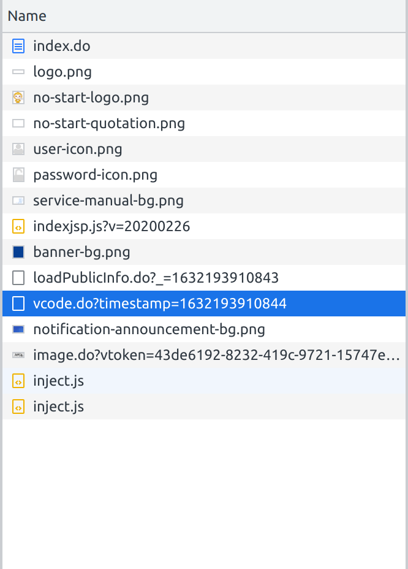
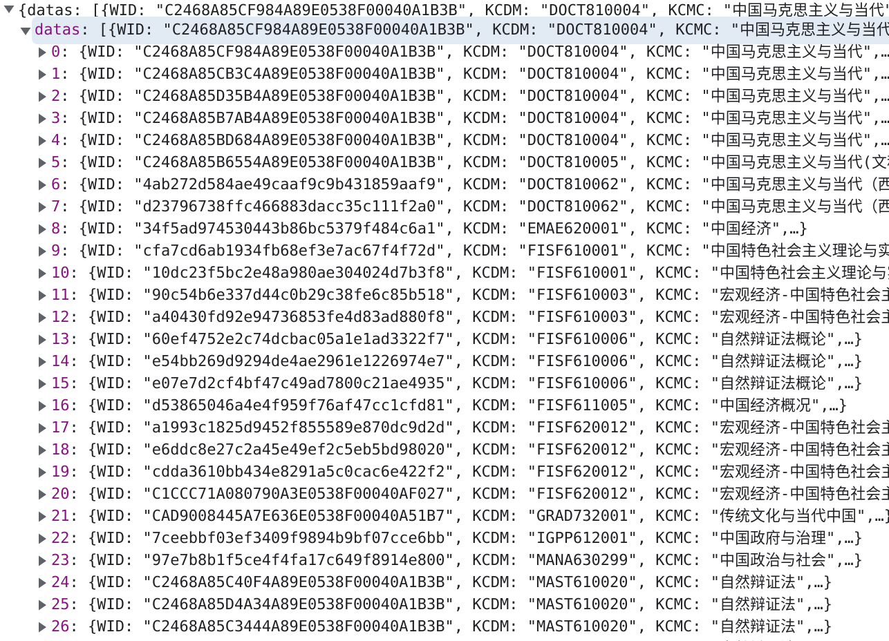

本文档将介绍选课系统与用户交互流程及相应的自动选课脚本实现

## 交互流程

### 登陆

**以下 URL 接口中带有 TIMESTAMP 字段的，均表示当前时间的时间辍**



进入选课登陆界面后，F12 进入开发者模式可以看到网站优先加载一些静态资源，然后通过

```
GET http://yjsxk.fudan.edu.cn/yjsxkapp/sys/xsxkappfudan/login/4/vcode.do?timestamp=TIMESTAMP
```

获取 token，返回信息大致如下

```json
{
  "data": {
    "vode": null,
    "token": "43de6192-8232-419c-9721-15747e41acdd",
    "wid": null
  },
  "jtoken": null,
  "code": "1",
  "msg": "获取验证码成功",
  "timestamp": "1632193869430"
}
```

接着将 GET 返回字段中的 **data.token** 作为 query，向服务器发出

```
GET http://yjsxk.fudan.edu.cn/yjsxkapp/sys/xsxkappfudan/login/vcode/image.do?vtoken=43de6192-8232-419c-9721-15747e41acdd
```

服务器返回验证码的图片（png 格式），用户在填写好验证码后通过

```
POST http://yjsxk.fudan.edu.cn/yjsxkapp/sys/xsxkappfudan/login/check/login.do?timestrap=TIMESTAMP
```

发起登陆请求，POST 携带的登陆信息包括学号、DES 加密的密码（看起来信息办只保留 hash 后的密码）、验证码、以及**最开始的** GET 请求返回的 data.token。

```json
{
	"loginName": STUID,
    "loginPwd": HASH(Pwd),
    "verifyCode": XXXX,
    "vtoken": "43de6192-8232-419c-9721-15747e41acdd"
}
```

因此如果验证码输入失败，则需要重新 GET-GET-POST 获取新的 token 以及验证码以重新尝试登陆。

### 查看课程信息

登陆成功后跳转选课主界面，在每次获取一个类别课程的当前课程详情时通过

```
POST http://yjsxk.fudan.edu.cn/yjsxkapp/sys/xsxkappfudan/xsxkCourse/validateXsxkTabSfkf.do
```

进行验证，其 payload 格式如下

```json
{
	"bqdm": "zzllk"
}
```

不同类别的课程对应不同 bqdm（汉语拼音首字母）

```
政治理论课：zzllk
第一外国语：dywgy
专业外语：zywy
学位基础课：xwjck
学位专业课：xwzyk
专业选修课：zyxxk
公共选修课：ggxxk
其他可选课：qtkxk
```

验证通过后，接着获取课程

```
POST http://yjsxk.fudan.edu.cn/yjsxkapp/sys/xsxkappfudan/xsxkCourse/loadXXXXXCourseInfo.do?_=TIMESTAMP
```

**注意 loadXXXXXCourseInfo 中的 XXXXX 为待替换内容**，如下我们结合不同类别课程 POST 请求的 payload 一起说明，第一项即为 URL 中的替换项，第二项则为 payload 内容

```json
政治理论课：Xwggk，{ 'query_tabszwid': 1, 'pageIndex': 1, 'pageSize': 10 }
第一外国语：Xwggk，{ 'query_tabszwid': 2, 'pageIndex': 1, 'pageSize': 10 }
专业外语：Xwggk，{ 'query_tabszwid': 3, 'pageIndex': 1, 'pageSize': 10 }
学位基础课：Xwzyk， { 'query_tabszwid': 4, 'pageIndex': 1, 'pageSize': 10 }
学位专业课：Xwzyk， { 'query_tabszwid': 5, 'pageIndex': 1, 'pageSize': 10 }
专业选修课：Xwzyk， { 'query_tabszwid': 6, 'pageIndex': 1, 'pageSize': 10 }
公共选修课：Ggxxk， { 'lx': 9, 'pageIndex': 1, 'pageSize': 10 }
其他可选课：Qtxxk， { 'query_kkyx': 开课院系, 'lx': 10, 'pageIndex': 1, 'pageSize': 10 }
```

服务器返回课程列表，判定当前课程是否选满通过 DQRS（当前人数） $\ge$ KXRS（可选人数） 是否成立。



### 选修课程

当要选修某一课程时通过

```
POST http://yjsxk.fudan.edu.cn/yjsxkapp/sys/xsxkappfudan/xsxkCourse/choiceCourse.do?_=TIMESTAMP
```

发起选课请求，请求的 payload 格式如下，

```json
{
	"bjdm": "2021202201COMP620005.01"
    "lx": 8
    "bqmc": "学位基础课"
    "csrfToken": "0276a5bf9b194dd6b7fff6afdd059f78"
}
```

bjdm 即为上一个 POST 请求返回课程的 BJDM 字段，lx 对应关系如下，bqmc 基本上对应 KCLBMC 字段，*第一外国语*（KCLBMC 为 第一外国语课）与 *其他可选课*（KCLBMC 为 其他选修课）除外。

```
政治理论课：6
第一外国语：7
专业外语：7
学位基础课：8
学位专业课：8
专业选修课：8
公共选修课：9
其他可选课：10
```

csrfToken 是为了防止

> 钓鱼网站利用用户正常登录产生的 cookie，让用户发送一张有内容的表单，并携带用户的正常 cookies 访问网站，达到将伪造的表单通过用户之手传到网站上的目的。

选课系统在当前页面中生成了 csrfToken 单元，其大致格式如下，

```
<input type="text" style="display:none;" id="csrfToken" value='0276a5bf9b194dd6b7fff6afdd059f78' />
```

可以通过

```
GET http://yjsxk.fudan.edu.cn/yjsxkapp/sys/xsxkappfudan/xsxkHome/gotoChooseCourse.do
```

获取当前用户界面的 html 文件，利用 **BeautifulSoup** 解析出 value（bs4.find(id="csrfToken")['value']）

最后通过

```
POST http://yjsxk.fudan.edu.cn/yjsxkapp/sys/xsxkappfudan/xsxkCourse/loadXkjgRes.do?_=TIMESTAMP
```

获取选课结果，如果选课成功则 msg.code 为 1，否则在最开始 POST 时即会返回失败原因如 *上课时间存在冲突 （冲突课程：分布式系统）(#4qx8h)*，因此每一门课程的选修都需要经过 GET（csrfToken）-POST-POST 的流程。

## 项目实现

*To be continue*

## 参考文献

- 对本项目中涉及到的 Web 交互感兴趣的，可以参考 https://cslg.info/blog/2020-11-23-PAFD-EXPLAINED/
- csrfToken https://www.cnblogs.com/sablier/p/11099909.html